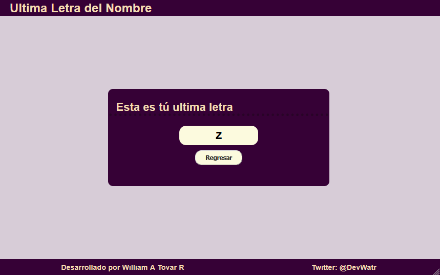

# Ultima Letra
## Aplicacion en HTML / CSS / JS para sacar la ultima letra de un String

    
    

Proyecto para el curso base de JS de Platzi en el cual se pone en practica los conceptos de edicion de String

    Puedes probar la aplicacion en el siguiente Link!

(https://williamtovar.github.io/ultimaLetra/)

## Autores ✒️

* **William A. Tovar R.** - *Desarrollador* - [williamtovar](https://github.com/williamtovar)